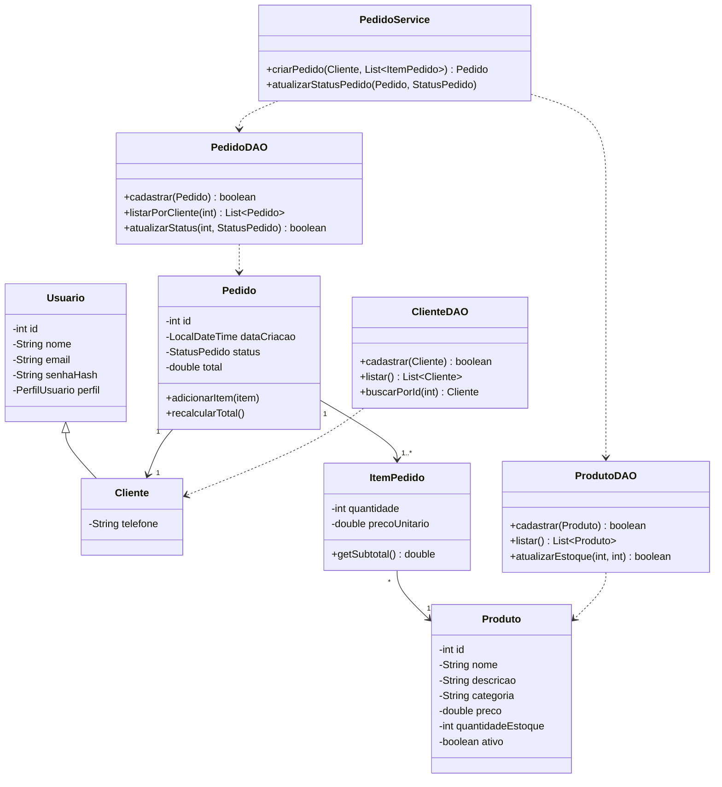

# Diagrama Simples de Classes - TechNova Solucoes Desktop

```mermaid
classDiagram
    class Usuario {
      -int id
      -String nome
      -String email
      -String senhaHash
      -PerfilUsuario perfil
    }

    class Cliente {
      -String telefone
    }

    class Produto {
      -int id
      -String nome
      -String descricao
      -String categoria
      -double preco
      -int quantidadeEstoque
      -boolean ativo
    }

    class Pedido {
      -int id
      -LocalDateTime dataCriacao
      -StatusPedido status
      -double total
      +adicionarItem(item)
      +recalcularTotal()
    }

    class ItemPedido {
      -int quantidade
      -double precoUnitario
      +getSubtotal() double
    }

    class ProdutoDAO {
      +cadastrar(Produto) boolean
      +listar() List~Produto~
      +atualizarEstoque(int, int) boolean
    }

    class ClienteDAO {
      +cadastrar(Cliente) boolean
      +listar() List~Cliente~
      +buscarPorId(int) Cliente
    }

    class PedidoDAO {
      +cadastrar(Pedido) boolean
      +listarPorCliente(int) List~Pedido~
      +atualizarStatus(int, StatusPedido) boolean
    }

    class PedidoService {
      +criarPedido(Cliente, List~ItemPedido~) Pedido
      +atualizarStatusPedido(Pedido, StatusPedido)
    }

    Usuario <|-- Cliente
    Pedido "1" --> "1" Cliente
    Pedido "1" --> "1..*" ItemPedido
    ItemPedido "*" --> "1" Produto
    ProdutoDAO ..> Produto
    ClienteDAO ..> Cliente
    PedidoDAO ..> Pedido
    PedidoService ..> PedidoDAO
    PedidoService ..> ProdutoDAO
```
